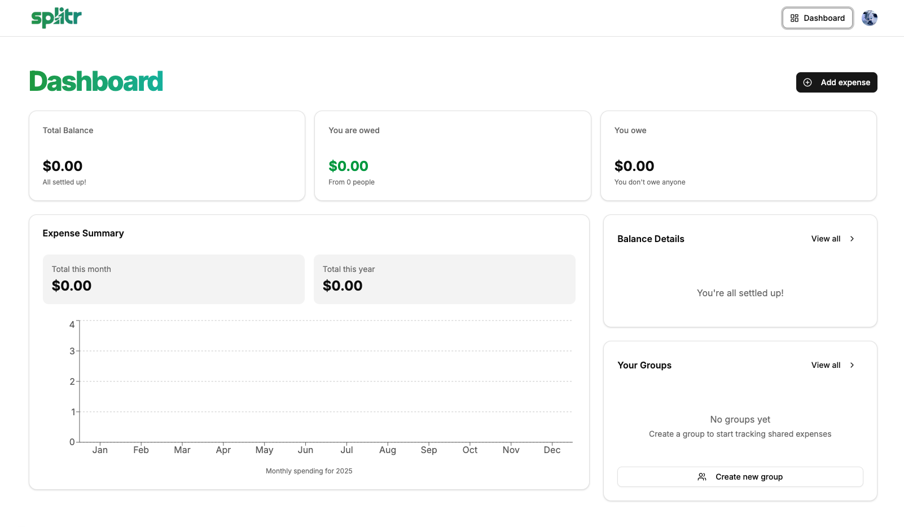

<h1 align="center"> Splitr 💸 – AI-Powered Expense Manager & Smart Settlements </h1>
<div align="center">


Splitr is a sleek, AI-driven web app that helps you manage personal and group expenses effortlessly. Inspired by Splitwise, Splitr lets you track expenses, settle debts smartly, analyze spending with real-time dashboards, and receive AI-powered insights and reminders. Built with modern tools like **Next.js**, **Convex**, **Gemini AI**, and **ShadCN UI**, it offers blazing-fast performance and a clean, responsive design.

</div>

---

## 🌟 Features

* **🧾 Add & Split Expenses**: Split equally, by percentage, or custom amounts.
* **🤝 Group & Individual Tracking**: Track who owes whom in real time.
* **⚡ Smart Debt Simplification**: Reduce unnecessary transactions automatically.
* **📊 Expense Analytics Dashboard**: Monthly trends, net balances & detailed views.
* **🧠 AI-Powered Insights**: Personalized spending analysis & smart reminders (Gemini AI).
* **🔔 Email Reminders**: Stay on top of dues with AI-generated emails (via RESEND).
* **👥 Contact & Group Management**: Create/join groups, manage members & payments.
* **📲 Fully Responsive UI**: Optimized for mobile, tablet, and desktop.

---

## 🛠️ Tech Stack

| Tech                                                                                                 | Description                               |
| ---------------------------------------------------------------------------------------------------- | ----------------------------------------- |
|                  | React Framework for frontend              |
|  | Utility-first CSS framework               |
|              | Beautiful pre-built UI components         |
|        | Static typing for better dev experience   |
|                 | Real-time backend & database              |
|              | AI for insights and reminders             |
|              | Transactional email service for reminders |
|          | Event-driven serverless workflows         |
|                       | Hosting & deployment                      |

---

## 🧭 How It Works

1. **Create or Join a Group**: Invite friends and manage shared expenses.
2. **Add Expenses**: Split equally, by percentage, or custom.
3. **Track Debts**: Real-time updates on what’s owed.
4. **View Dashboard**: Visual charts of your spending trends.
5. **AI Insights**: Receive smart analysis and reminders.
6. **Settle Up**: Use smart settlement suggestions to minimize transactions.

---

## 📸 UI Preview

<div align="center">



> It's a fresh launch, so the dashboard is looking a bit empty—no expenses yet, haha! 🎉

</div>

---

## 🧪 Local Development

Clone the repository and set up your environment:

```bash
# Clone the repo
git clone https://github.com/codewmanas/splitr-ai.git

# Navigate to the project folder
cd splitr

# Install dependencies
npm install

# Run the development server
npm run dev
```

### 🔐 Environment Variables

Create a `.env` file in the root directory and add the following variables:

```env
# Deployment used by `npx convex dev`
CONVEX_DEPLOYMENT=

NEXT_PUBLIC_CONVEX_URL=

NEXT_PUBLIC_CLERK_PUBLISHABLE_KEY=
CLERK_SECRET_KEY=

NEXT_PUBLIC_CLERK_SIGN_IN_URL=/sign-in
NEXT_PUBLIC_CLERK_SIGN_UP_URL=/sign-up

CLERK_JWT_ISSUER_DOMAIN=

RESEND_API_KEY=

GEMINI_API_KEY=
```

---

## 📬 Contact & Support

Want to contribute or suggest a feature? Open an issue or pull request! For other queries:

<p>
📧 Email: <a href="mailto:manas.kolaskar@somaiya.edu">My Mail</a><br>
</p>

---

<p>
Made with ❤️ by Manas and the Splitr team.
</p>
